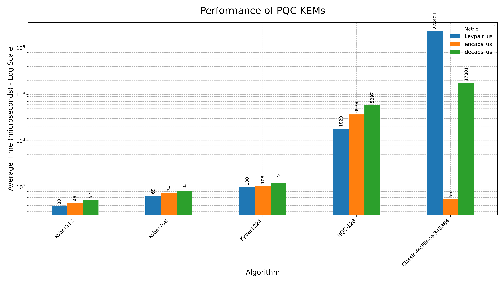
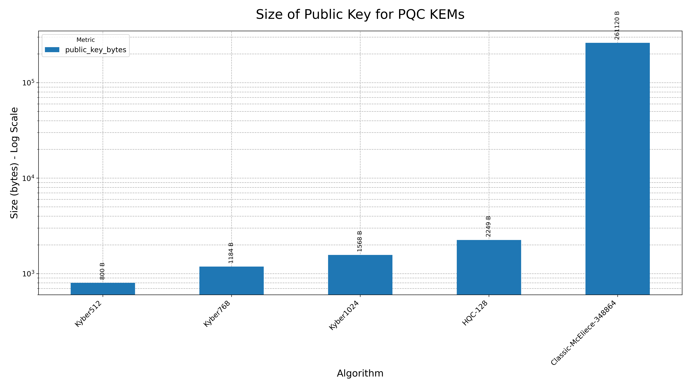
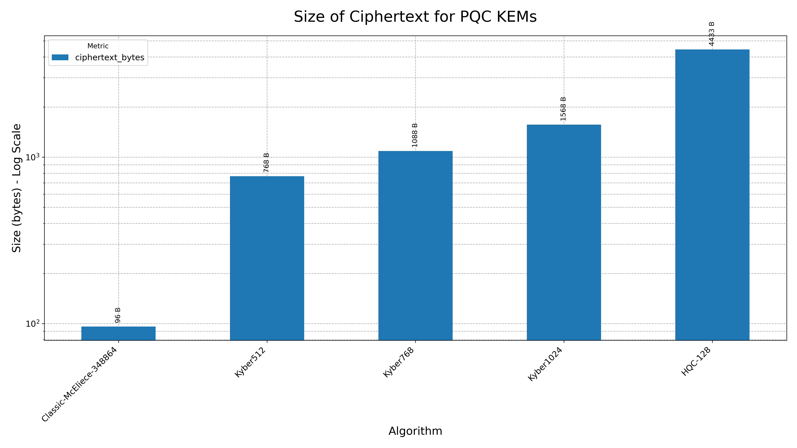
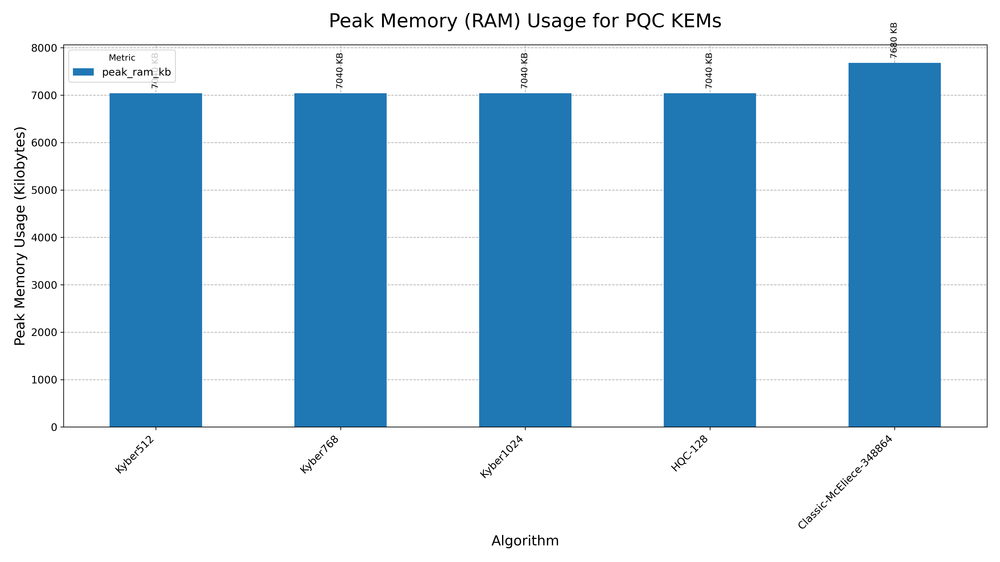
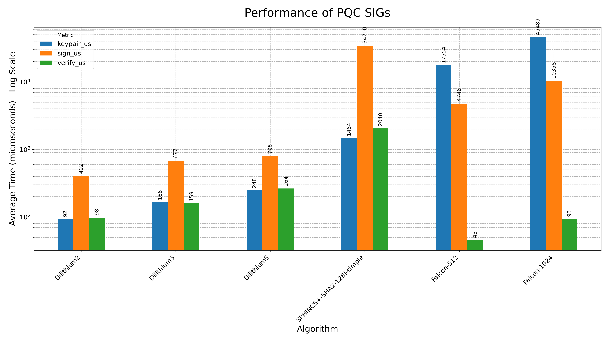
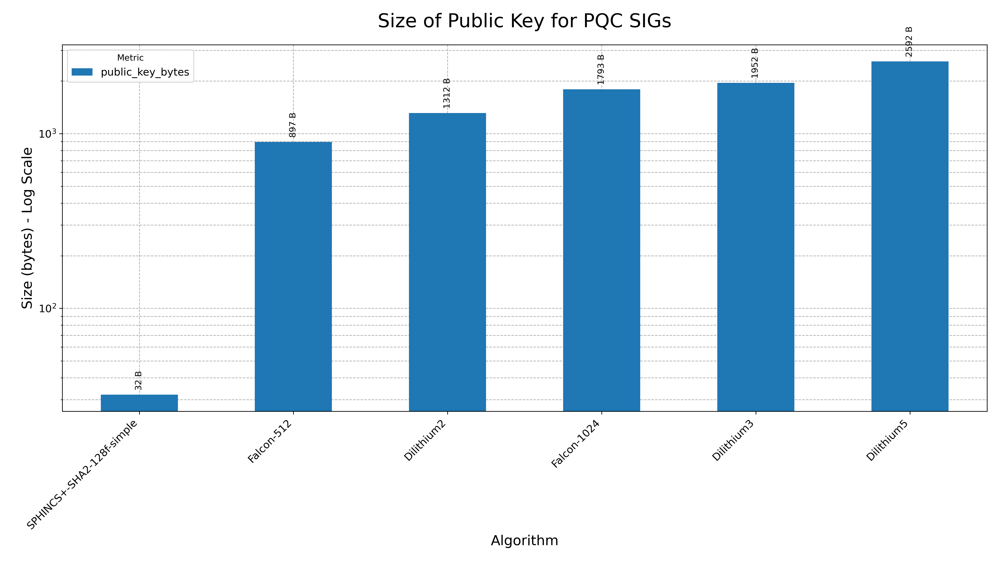
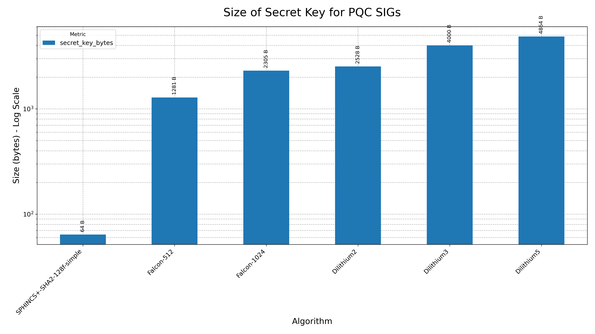
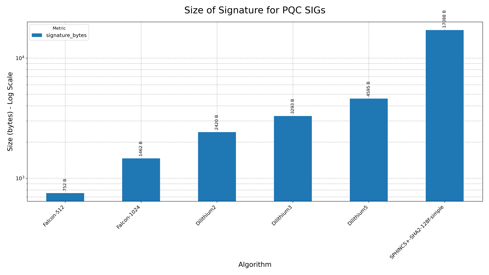
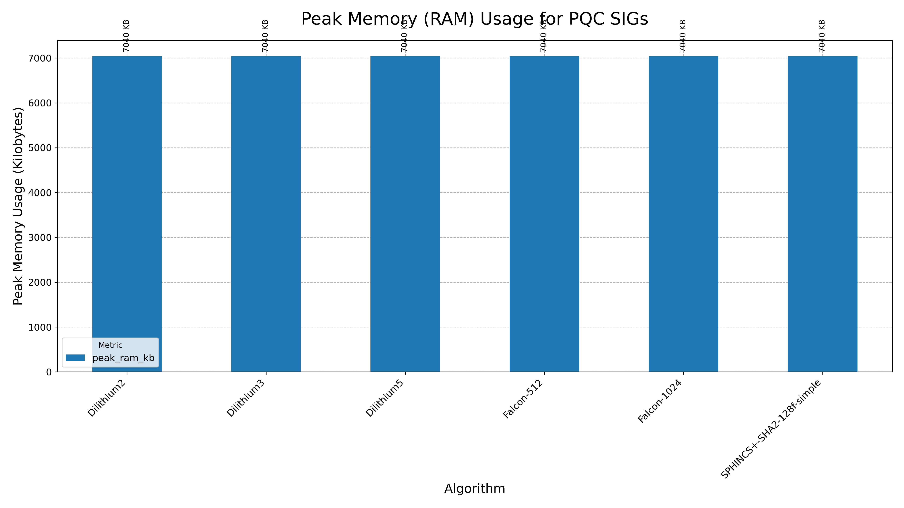

# PQC Performance Explorer

License: MIT

An open-source project dedicated to benchmarking, analyzing, and exploring the performance of Post-Quantum Cryptography (PQC) algorithms.

## Motivation

The advent of large-scale quantum computers poses a significant threat to modern public-key cryptography, which underpins the security of the internet. The field of Post-Quantum Cryptography (PQC) aims to develop new cryptographic algorithms that are secure against both classical and quantum computers.

As the world prepares to transition to these new standards, understanding their real-world performance characteristics (speed, memory usage, key/signature sizes) is crucial for developers, engineers, and researchers. This project provides a transparent, reproducible framework for conducting these performance measurements.

## Project Goals

- To establish a consistent and automated pipeline for benchmarking PQC algorithms.
- To measure and compare the performance of leading PQC candidates on various hardware platforms.
- To analyze the trade-offs between security, speed, and other performance metrics.
- To share our findings with the community through open-source code and detailed reports.

---

## Phase 1: CPU Performance Benchmark (Completed)

We successfully completed the first phase of this project, focusing on the core computational speed of the PQC algorithms selected for standardization by NIST.

---

## Phase 2: Expand Performance Metrics (In Progress)

We are currently expanding our analysis to include crucial metrics beyond raw speed. The first part of this phase, focusing on cryptographic object sizes, is now complete.

### Achievements in Phase 2.1:

- **Developed a custom C utility** (`print_sizes`) that directly queries the `liboqs` library to obtain precise size information for keys, ciphertexts, and signatures.
- **Expanded the automated pipeline** to:
    - Compile the custom utility.
    - Collect size data for all tested algorithms.
    - Merge speed and size data into a unified dataset.
    - Generate new charts comparing the sizes of cryptographic objects.

---

## Results

The following charts represent the average time for cryptographic operations and the size of associated cryptographic objects. All benchmarks were run on an x86-64 server without AVX2 extensions, with each speed test running for a duration of 1 second per algorithm.

*(Note: Please regenerate these figures by running the pipeline on your machine to get the most accurate results for your specific hardware.)*

### Key Encapsulation Mechanisms (KEMs)

**Performance (Time)**


**Size Metrics (Bytes)**






### Digital Signature Schemes

**Performance (Time)**


**Size Metrics (Bytes)**






## Getting Started: How to Reproduce Our Results

You can easily reproduce these results on your own machine by following these steps.

### Prerequisites

- A Linux-based operating system.
- Git
- Conda package manager.

### Setup & Execution

**1. Clone the Repository**

Clone this project along with its `liboqs` submodule.
```bash
git clone --recurse-submodules https://github.com/ailabteam/pqc-performance-explorer.git
cd pqc-performance-explorer
```

**2. Set Up the Environment**

This script creates a self-contained Conda environment named `pqc-research` with all necessary dependencies, including a compatible version of OpenSSL.
```bash
bash setup/setup_env.sh
conda activate pqc-research
```

**3. Run the Full Pipeline**

To make things easy, you can run the entire pipeline with a single script. It will clean old results, build the `liboqs` library and our custom tools, run new benchmarks for speed and size, parse all data, and generate the final charts in the `figures/` directory.
```bash
bash run_full_pipeline.sh
```
The pipeline will guide you through all 7 stages, and upon completion, all results and figures will be up-to-date.

---

## Project Structure
```
.
├── analysis/         # Python scripts for parsing, merging, and visualization
│   ├── parse_results.py
│   ├── merge_data.py
│   └── visualize_results.py
├── build/            # Compiled custom utilities (e.g., print_sizes)
├── figures/          # Output charts and plots (.png)
├── results/          # Raw (.txt) and processed (.csv) benchmark data
├── scripts/          # Shell scripts for running benchmarks and collecting data
│   ├── run_oqs_benchmark.sh
│   └── collect_sizes.sh
├── setup/            # Environment and library build scripts
├── third_party/      # Git submodule for liboqs
├── utils/            # Source code for custom C utilities
│   └── print_sizes.c
└── run_full_pipeline.sh # The main orchestrator script
```

## Roadmap: Future Work

This project is just getting started. Our roadmap includes several exciting extensions:

- **Phase 2: Expand Performance Metrics (Completed)**
    - [x] Measure and analyze key sizes, ciphertext sizes, and signature sizes.
    - [x] Integrate memory profiling to measure peak RAM consumption during cryptographic operations.
- **Phase 3: Cross-Platform Benchmarking**
    - [ ] **Next:** Run the same benchmark suite on a resource-constrained device (e.g., Raspberry Pi 4) to analyze performance in an IoT context.
    - [ ] Benchmark on an ARM64-based server (e.g., AWS Graviton) to compare x86-64 vs. ARM performance.
- **Phase 4: Real-World Scenario Analysis**
    - [ ] Utilize the OQS integration with OpenSSL to benchmark the overhead of PQC in a full TLS 1.3 handshake.
    - [ ] Compare the performance of hybrid modes (e.g., Kyber + X25519) vs. PQC-only modes.
- **Phase 5: Publication & Reporting**
    - [ ] Summarize all findings into a detailed technical report or blog post.
    - [ ] Create interactive visualizations for easier data exploration.

## Contributing

Contributions are welcome! If you have ideas for new benchmarks, find a bug, or want to improve the analysis scripts, please feel free to open an issue or submit a pull request.

## License

This project is licensed under the MIT License. See the `LICENSE` file for details.

## Acknowledgments

This work would not be possible without the incredible efforts of the [Open Quantum Safe (OQS) project](https://openquantumsafe.org/), which provides the open-source library for post-quantum cryptography used in our experiments.

